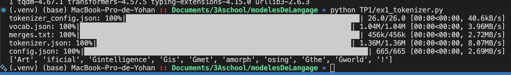
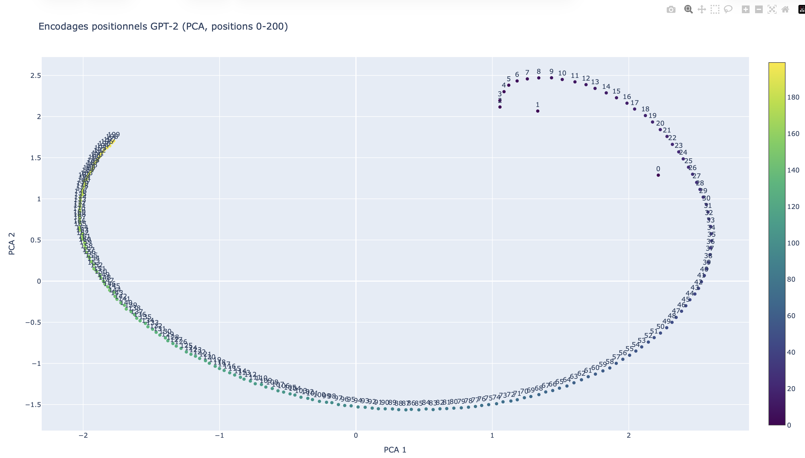
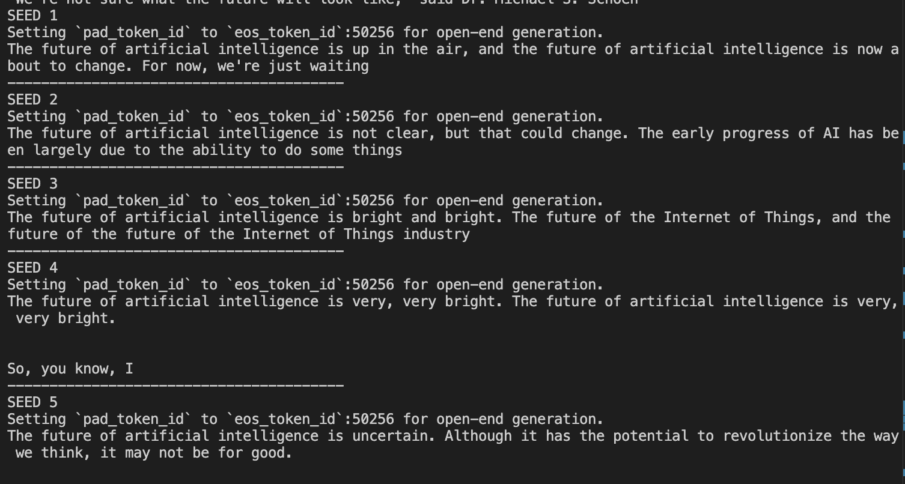

# TP1 modèles de langage 
##### Yohan Delière


### Exercice 2 : Découverte du tokenizer GPT-2




```
['Art', 'ificial', 'Ġintelligence', 'Ġis', 'Ġmet', 'amorph', 'osing', 'Ġthe', 'Ġworld', '!']

```

##### pourquoi certains tokens commencent-ils par un symbole “spécial” ?

Ils viennent du tokenizer GPT‑2 (BPE) qui encode l’espace comme un caractère spécial Ġ.
Concrètement, un token qui commence par Ġ indique qu’il y avait un espace juste avant dans le texte original. C’est une astuce pour préserver l’information de séparation des mots sans garder des tokens “espace” séparés.


| token (decodage) | ID   | remarque |
| --- | --- | --- |
| Art | 8001 | debut de mot |
| icial | 9542 | suite de mot |
|  intelligence | 4430 | espace avant |
|  is | 318 | espace avant |
|  met | 1138 | espace avant |
| amorph | 37670 | suite de mot |
| osing | 2752 | suite de mot |
|  the | 262 | espace avant |
|  world | 995 | espace avant |
| ! | 0 | ponctuation |

Les tokens sont des morceaux de texte (sous-mots) produits par le tokenizer. Les token IDs sont les entiers associes a chaque token dans le vocabulaire du modele.

Observations (BPE / sous-mots / fragments frequents) :
- Mots courants coupes en sous-mots frequents : "Artificial" -> "Art" + "icial", "metamorphosing" -> "met" + "amorph" + "osing". GPT-2 reutilise des fragments vus souvent.
- Les mots longs/rares sont plus souvent decoupes en plusieurs sous-parties, ce qui permet de couvrir beaucoup de mots avec un vocabulaire limite (intuition BPE).
- La ponctuation est un token a part ("!"), ce qui facilite l'apprentissage des patterns de fin de phrase.
- Les espaces sont encodes dans le token via le prefixe "Ġ" (ex: "Ġintelligence", "Ġis"), un fragment frequent qui marque debut de mot + espace.


```
['ant', 'idis', 'establishment', 'arian', 'ism']
Nombre de sous-tokens: 5
```

Ce mot est long et peu frequent, donc le BPE le decoupe en fragments reutilisables.
Chaque morceau correspond a des sous-mots vus souvent (ant-, -idis-, establishment, -arian-, -ism).
Cela permet de conserver une representation stable sans avoir a memoriser le mot entier.
La decoupe respecte des morceaux morphologiques plausibles, ce qui aide le modele a generaliser.

### Exercice 3 : Découverte du tokenizer GPT-2


```
model.safetensors: 100%|██████████████████████████████████████████████████████| 548M/548M [00:12<00:00, 42.9MB/s]
Shape position embeddings: torch.Size([1024, 768])
n_embd: 768
n_positions: 1024
```

Shape: torch.Size([1024, 768]).

Interprétation:

1024 = nombre de positions possibles (indices de position) pour lesquelles le modèle apprend un vecteur.
768 = dimension de chaque embedding positionnel, égale à n_embd (dimension du modèle).
n_positions correspond donc à la longueur maximale de contexte (nombre de tokens) que GPT‑2 peut traiter en entrée pour un modèle causal. Au‑delà, il n’a pas d’embedding positionnel défini (et on doit tronquer ou utiliser un mécanisme d’extension).


On voit que les points suivent une trajectoire assez continue : quand la position augmente, les points avancent progressivement le long d’une courbe. Il n’y a pas vraiment de “clusters”, plutôt une suite ordonnée. La position 0 est très éloignée des autres (un outlier), ce qui peut vouloir dire que le début de séquence est représenté différemment.
La PCA sert à réduire la dimension (ex. 768) en 2D pour pouvoir visualiser. Sans PCA, on ne peut pas “voir” la structure des embeddings, avec PCA on repère facilement la continuité, les outliers et la forme globale.




Entre 0–50, on voit surtout une petite courbe assez simple et la position 0 ressort comme un point à part.
Entre 0–200, l’échelle change et la forme devient beaucoup plus grande, on voit une sorte de grand arc presque “en boucle”.
C’est moins lisible car il y a beaucoup plus de points et les étiquettes se chevauchent, mais la structure globale apparaît mieux.
On remarque aussi que les premières positions restent un peu séparées du reste.


Cela suggère que les embeddings de position ne sont pas aléatoires, ils suivent une trajectoire continue dans l’espace.
Quand on augmente jusqu’à 200, on voit que cette trajectoire a une structure plus globale, pas juste locale.
GPT-2 encode la position de façon régulière sur une variété de faible dimension.
La position 0 semble spéciale, donc le début de séquence est probablement représenté différemment.

### Exercice 4 : Probabilités et génération de texte avec GPT-2

```
1 'ificial' 1.920e-05
2 ' intelligence' 1.504e-01
3 ' is' 1.955e-01
4 ' fascinating' 6.504e-04
5 '.' 1.773e-01

```

GPT-2 est un modèle causal qui prédit le token suivant. Les logits à l’index t-1 représentent donc la distribution de probabilité de token_t sachant tous les tokens précédents token_0..token_{t-1}. Autrement dit, la sortie à la position t-1 sert à prédire le “prochain” token, qui est exactement celui à la position t dans la phrase. C’est pour ça qu’on lit probs[0, t-1, tok_id] et pas probs[0, t, tok_id]


#### Question 4.b Calculez maintenant la log-probabilité totale de la phrase (somme des log-probas conditionnelles), puis la perplexité associée.

```
1 'ificial' 1.920e-05
2 ' intelligence' 1.504e-01
3 ' is' 1.955e-01
4 ' fascinating' 6.504e-04
5 '.' 1.773e-01
total_logp: -23.4549400806427
avg_neg_logp: 4.69098801612854
perplexity: 108.96078165213443
```

La perplexité mesure à quel point un modèle “hésite” quand il prédit la suite d’un texte.
Plus elle est faible, plus le modèle attribue des probabilités élevées aux bons tokens.
On peut l’interpréter comme le “nombre moyen de choix” que le modèle considère à chaque pas.
Une perplexité de 1 serait parfaite (aucune surprise).
Ici ~109 signifie que la phrase est plutôt surprenante pour le modèle.
C’est une mesure globale de la qualité prédictive sur une séquence.
Elle dépend du vocabulaire, du texte et du modèle.
On compare surtout des perplexités entre modèles ou sur des corpus similaires.

#### Question 4.c Comparez (log-proba et perplexité) entre :

"Artificial intelligence is fascinating."
"Artificial fascinating intelligence is."

```
1 'ificial' 1.920e-05
2 ' fascinating' 1.811e-06
3 ' intelligence' 2.291e-04
4 ' is' 1.236e-01
5 '.' 4.956e-04
total_logp: -42.16451120376587
avg_neg_logp: 8.432902240753174
perplexity: 4595.818929368644
```

La perplexité est beaucoup plus élevée pour la phrase 2, donc le modèle est très surpris.
Cela arrive souvent quand l’ordre des mots est peu naturel ou peu grammatical.
GPT‑2 a appris des régularités de l’anglais dans ses données d’entraînement.
Quand une phrase respecte ces régularités, il attribue des probas plus fortes.
Si la phrase est inhabituelle, les probas chutent et la perplexité explose.
Donc l’écart reflète la “compatibilité” avec la distribution d’entraînement.
Plus une phrase ressemble aux exemples vus, plus elle est jugée probable.
Ici la phrase 2 casse ces régularités, d’où une perplexité énorme.


#### Question 4.d Comparez maintenant avec une phrase en français :

```
1 "'" 3.138e-03
2 'intelligence' 2.805e-05
3 ' artific' 7.069e-06
4 'iel' 1.810e-02
5 'le' 1.711e-01
6 ' est' 1.325e-02
7 ' fasc' 3.444e-05
8 'in' 6.783e-02
9 'ante' 4.595e-03
10 '.' 5.368e-02
total_logp: -59.481369495391846
avg_neg_logp: 5.948136949539185
perplexity: 383.0390528082057
```


GPT‑2 est entraîné surtout sur de l’anglais, donc le français est moins fréquent.
La tokenisation en morceaux (“artific”, “iel”, “fasc”, “in”, “ante”) réduit aussi la probabilité de chaque token.
Résultat: la phrase est moins probable que l’anglais correct, mais plus probable qu’une phrase anglaise très peu naturelle.


#### Question 4.e : Pour le préfixe "Artificial intelligence is", affichez les 10 tokens les plus probables pour le token suivant, avec leurs probabilités.

```
' a' 1.205e-01
' the' 5.254e-02
' not' 4.324e-02
' an' 3.092e-02
' now' 2.062e-02
' one' 1.890e-02
' also' 1.880e-02
' already' 1.716e-02
' becoming' 1.606e-02
' just' 1.422e-02
```

C’est plausible : après “Artificial intelligence is”, le modèle propose surtout des articles/adverbes (“ a”, “ the”, “ not”, “ an”, “ now”…), ce qui colle à une suite grammaticale.
On voit des tokens avec espace en tête (“ a”, “ the”, etc.), c’est normal en BPE : l’espace est souvent intégré au token.
Pas de ponctuation ici, juste des mots probables.


### Exercice 5 : Exploration des méthodes de génération avec GPT-2


#### Question 5.a : Créez un fichier TP1/ex4_generation.py. Chargez GPT-2 et le tokenizer. Fixez un seed pour rendre vos résultats reproductibles.


Seed utilisé : 42.
On le fixe pour rendre la génération déterministe et reproductible : avec le même seed, on obtient les mêmes sorties, ce qui facilite la comparaison et la correction.


#### Question 5.b : Générez une suite avec décodage glouton (greedy decoding), longueur maximale 50 tokens.


```
(.venv) MacBook-Pro-de-Yohan :: Documents/3Aschool/modelesDeLangage » python TP1/ex4_generation.py
Setting `pad_token_id` to `eos_token_id`:50256 for open-end generation.
The future of artificial intelligence is uncertain.

"We're not sure what the future will look like," said Dr. Michael S. Schoen
```


On fixe le seed et la génération est déterministe, donc le même prompt donne le même texte à chaque run.


#### Question 5.c : Générez maintenant du texte avec sampling en utilisant : température = 0.7, top-k = 50, top-p = 0.95. Faites au moins 5 générations (en changeant le seed entre chaque, ou en utilisant un générateur).



- Seed 1 : The future of artificial intelligence is up in the air, and the future of artificial intelligence is now about to change. For now, we're just waiting

- Seed 4 : The future of artificial intelligence is very, very bright. The future of artificial intelligence is very, very bright. So, you know, 


Greedy donne une sortie plus stable et cohérente, mais peu variée et parfois répétitive.

Sampling donne plus de diversité entre seeds, mais peut être moins cohérent ou plus court.

Température plus haute augmente le hasard donc plus de diversité mais plus de risque d’erreurs
Top k limite aux k mots les plus probables donc plus petit k plus contrôlé
Top p limite à un ensemble de probabilité p donc plus petit p plus prudent


#### Question 5.d : Ajoutez une pénalité de répétition élevée (repetition_penalty=2.0) et comparez.


Avec la pénalité :

```
(.venv) MacBook-Pro-de-Yohan :: Documents/3Aschool/modelesDeLangage » python TP1/ex4_generation.py
Setting `pad_token_id` to `eos_token_id`:50256 for open-end generation.
The future of artificial intelligence is uncertain.

"We're not sure what the future will look like," said Dr. Michael S. Schoen
SEED 1
Setting `pad_token_id` to `eos_token_id`:50256 for open-end generation.
The future of artificial intelligence is up in the air, and it may not be as interesting or useful to us humans. But we're going down a
----------------------------------------
SEED 2
Setting `pad_token_id` to `eos_token_id`:50256 for open-end generation.
The future of artificial intelligence is not clear, but that could change. The early progress on AI was made by scientists in the late '80s and
----------------------------------------
SEED 3
Setting `pad_token_id` to `eos_token_id`:50256 for open-end generation.
The future of artificial intelligence is bright and exciting. We need a way to capture that information, but it has been very challenging for us," said James
----------------------------------------
SEED 4
Setting `pad_token_id` to `eos_token_id`:50256 for open-end generation.
The future of artificial intelligence is very, VERY bright. The next big thing will be the ability to use robotics and AI in ways that are much less
----------------------------------------
SEED 5
Setting `pad_token_id` to `eos_token_id`:50256 for open-end generation.
The future of artificial intelligence is uncertain. Although it has the potential to revolutionize our lives and make people smarter, there are still many unanswered questions about
```
on voit moins de répétitions avec repetition_penalty=2.0.
Sans penalty tu as des boucles visibles, par exemple
Seed 3 “bright and bright” et “future of the future”
Seed 4 répète deux fois “very, very bright” (question précédente).
Avec penalty ces répétitions disparaissent ou deviennent plus rares, et les phrases avancent plus.
##### Effets secondaires :
Le texte peut devenir moins naturel ou moins fluide, car le modèle évite des mots pourtant légitimes à répéter
Il peut changer de sujet plus vite ou produire des formulations un peu forcées.
Parfois il rallonge en ajoutant du contenu pour éviter de répéter, ou au contraire coupe plus tôt si les choix deviennent “bloqués”


#### Question 5.e :  Essayez une température très basse puis très élevée (par exemple 0.1 et 2.0). Gardez top-k=50, top-p=0.95, et comparez.

##### Température 0.1 :

```
(.venv) MacBook-Pro-de-Yohan :: Documents/3Aschool/modelesDeLangage » python TP1/ex4_generation.py
Setting `pad_token_id` to `eos_token_id`:50256 for open-end generation.
The future of artificial intelligence is uncertain.

"We're not sure what the future will look like," said Dr. Michael S. Schoen
SEED 1
Setting `pad_token_id` to `eos_token_id`:50256 for open-end generation.
The future of artificial intelligence is uncertain. But the question remains: Will we ever be able to predict what will happen in our lives?
, a
----------------------------------------
SEED 2
Setting `pad_token_id` to `eos_token_id`:50256 for open-end generation.
The future of artificial intelligence is uncertain, but it's clear that the technology will be used to help us better understand our own lives.

----------------------------------------
SEED 3
Setting `pad_token_id` to `eos_token_id`:50256 for open-end generation.
The future of artificial intelligence is uncertain. The question remains: Will it ever be able to do anything about the human brain?

----------------------------------------
SEED 4
Setting `pad_token_id` to `eos_token_id`:50256 for open-end generation.
The future of artificial intelligence is uncertain, but it's clear that the technology will be used to help us better understand our lives.

----------------------------------------
SEED 5
Setting `pad_token_id` to `eos_token_id`:50256 for open-end generation.
The future of artificial intelligence is uncertain. But it's not impossible that we'll see a lot more intelligent machines than humans, and perhaps even some robots
```

##### Température 1.0 :
```
SEED 1
Setting `pad_token_id` to `eos_token_id`:50256 for open-end generation.
The future of artificial intelligence is up in the air, and you may not even realize it until about 2022 when Microsoft's HoloLens headset will be available
----------------------------------------
SEED 2
Setting `pad_token_id` to `eos_token_id`:50256 for open-end generation.
The future of artificial intelligence is not clear — but that could change. The early progress on AI was made by scientists in China, India and the United
----------------------------------------
SEED 3
Setting `pad_token_id` to `eos_token_id`:50256 for open-end generation.
The future of artificial intelligence is bright and the potential lies in a technological revolution that's being driven out by an unprecedented amount at MIT. The world has
----------------------------------------
SEED 4
Setting `pad_token_id` to `eos_token_id`:50256 for open-end generation.
The future of artificial intelligence is very, really important.
----------------------------------------
SEED 5
Setting `pad_token_id` to `eos_token_id`:50256 for open-end generation.
The future of artificial intelligence is now in the hands" with "robotic arms as weapons for terrorists, criminals and other 'terrorists.' The threat
----------------------------------------
```


À température basse (0.1), le modèle privilégie presque toujours les mots les plus probables. Le texte est donc plus cohérent, plus stable entre seeds, avec moins de surprises, mais il est aussi plus prévisible et moins créatif. Les sorties se ressemblent et explorent moins d’idées.
À température haute (1.0), le modèle accepte des mots moins probables. On obtient plus de diversité et des directions différentes selon la seed, mais la cohérence peut baisser. On observe des formulations bizarres, des guillemets mal placés, et parfois des idées plus extrêmes ou hors sujet. Cela illustre le compromis entre créativité et qualité.


#### Question 5.f : Génération avec beam search : num_beams=5, longueur max 50. Comparez avec greedy et sampling.

```
The future of artificial intelligence is in the hands of the next generation of scientists and engineers.

The future of artificial intelligence is in the hands of the next generation of scientists and engineers.

The future of artificial intelligence is in the hands of
```

Le beam search cherche une séquence plus probable globalement en explorant plusieurs candidats puis en gardant ceux qui maximisent la probabilité totale.
Résultat, la sortie est souvent plus cohérente et “propre”, mais aussi plus générique et moins diverse que le sampling.
Comme il privilégie les formulations très fréquentes, il peut aussi tomber dans des répétitions ou des phrases “safe” qui ressemblent à des slogans.


#### Question 5.g : Augmentez le nombre de beams (par exemple 10 puis 20). Mesurez le temps de génération (même approximatif) et commentez.


```
num_beams=10 time=1.575s
The future of artificial intelligence is in the hands of the next generation of scientists and engineers.

The future of artificial intelligence is in the hands of the next generation of scientists and engineers.

The future of artificial intelligence is in the hands of
Setting `pad_token_id` to `eos_token_id`:50256 for open-end generation.
num_beams=20 time=2.286s
The future of artificial intelligence is in the hands of the next generation of scientists and engineers.

The future of artificial intelligence is in the hands of the next generation of scientists and engineers.

The future of artificial intelligence is in the hands of
```


num_beams=10, max_length=50, early_stopping=True -> 1.575 s
num_beams=20, max_length=50, early_stopping=True -> 2.286 s

#### Pourquoi ça ralentit
Le beam search ne suit pas un seul chemin comme le greedy.
Il garde B phrases candidates en même temps.
À chaque nouveau token, il doit calculer les scores pour chaque beam puis trier et garder les meilleurs.
Donc plus num_beams est grand et plus la génération est longue, plus c’est lent.