# CI4 : Modèles de langage

##### Yohan Delière

####  Exercice 1 : Démarrage d'Ollama (local)

choix du modèle : qwen2.5 7b 

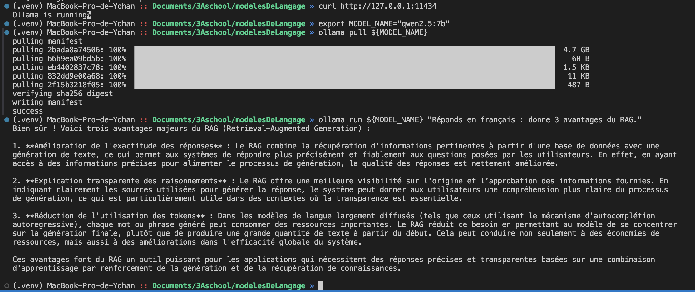

####  Exercice 2 : Créer la structure de données dans TP4/.

##### emails :

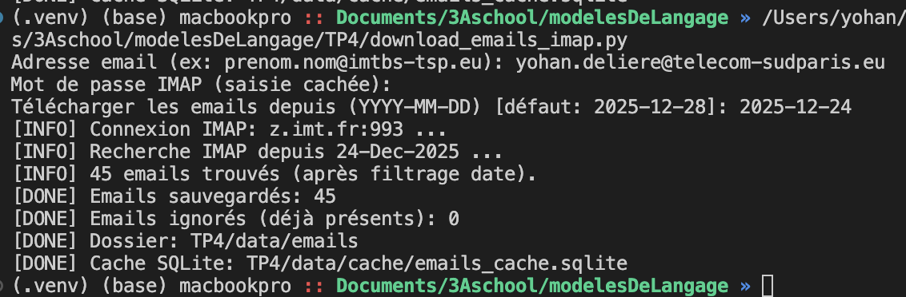

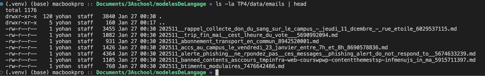

##### pdfs

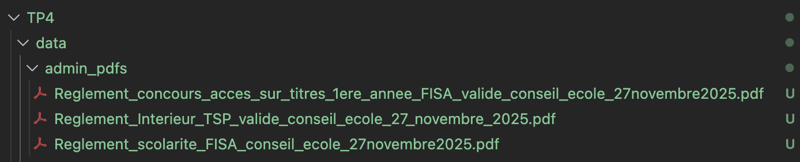

####  Exercice 3 : Indexation : charger PDFs + emails, chunker, créer l’index Chroma (persistant)

execution :

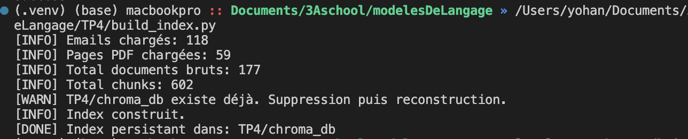

smoke test :

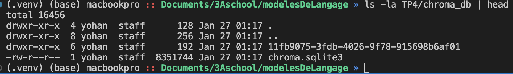

####  Exercice 4 : Retrieval : tester la recherche top-k (sans LLM) et diagnostiquer la qualité

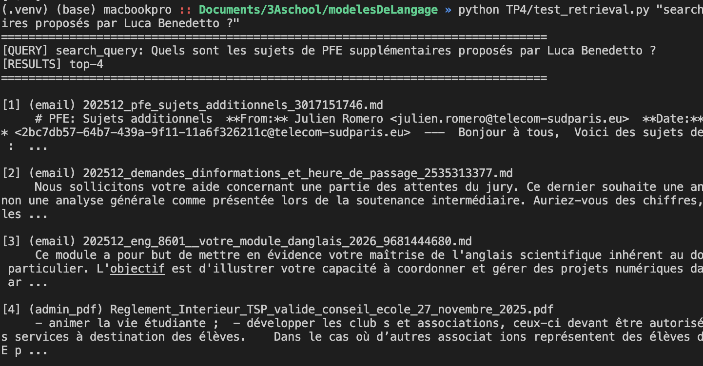

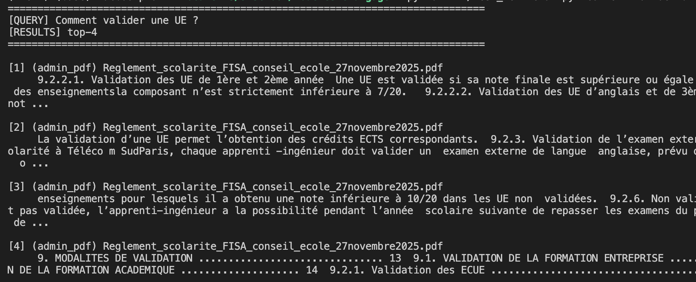

Le type de document récuperé selon la query semble logique (plutôt email ou plus administratif dependant de la question). Les chunks ne sont pas trop redondants, et sont en lien avec la question pour la deuxième query.

####  Exercice 5 : RAG complet : génération avec Ollama + citations obligatoires

Questions de reference : 

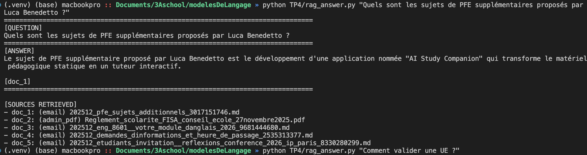

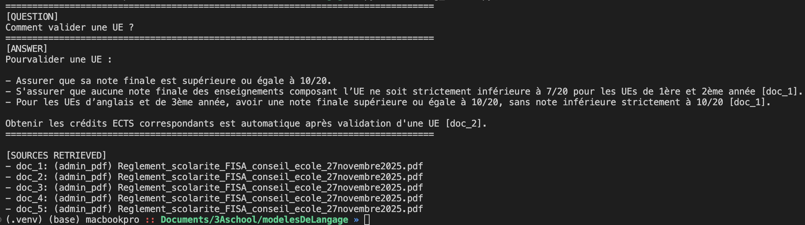

Test “robustesse” : poser une question hors corpus.

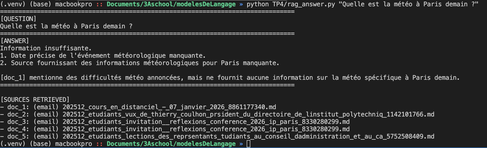

Les tests sont reussis !

####  Exercice 6 : Retrieval : tester la recherche top-k (sans LLM) et diagnostiquer la qualité

évaluation eval_recall : 
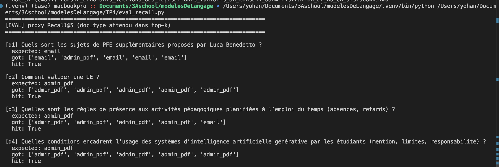

le score est de 10/10, visiblement les paramètres de chunking sont bien réglé pour notre dataset actuel

Ensuite nous passons aux tests pour noter 3 réponses générer sur 2 :

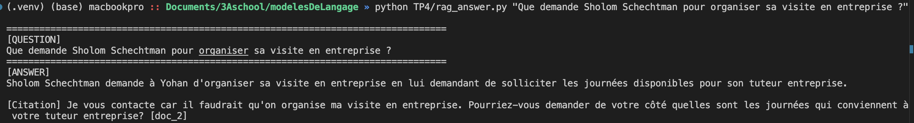

précis, sur 2/2

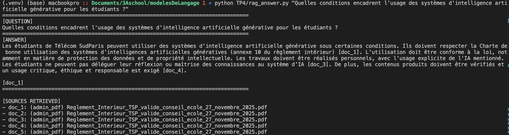

précis, sur 2/2

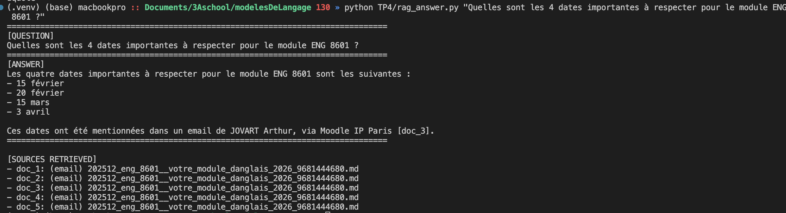

précis, sur 2/2. Je voulais mettre le sysème en difficulté avec des dates précises mais après verification, c'est les bonnes dates.

##### Analyse d’erreurs : documenter 2 échecs concrets.

Aucun echecs dans mes tests. Un peu avant, le système ne marchait pas du tout (aucune bonne réponse), mais j'ai réglé chunk_size et chunk overlap (diminution pour réduire le bruit) et maintenant cela marche parfaitement.

#### Conclusion

L'implémentation locale du pipeline RAG avec Qwen 2.5 et Nomic-MoE s'est révélée efficace, offrant une réponse fluide et un grounding solide via les citations. La principale difficulté fut la "dilution sémantique" : avec des chunks trop larges (1500), les emails courts étaient évincés par le bruit des documents administratifs. Le premier modèle d'embedding utilisé etait aussi moins efficace. L'ajustement à 500 caractères a été le facteur clé de succès pour la pertinence du retrieval. Pour améliorer le système, on pourrait ajouter un reranker après le premier filtrage.